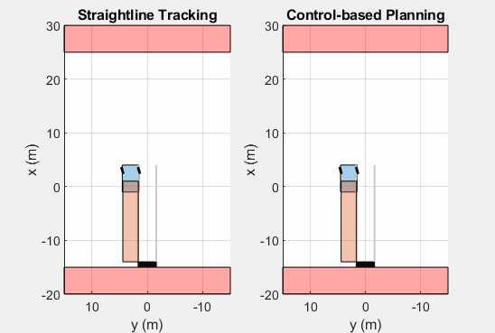

# Beep-Beep-Hiss

Beep-Beep-Hiss is an open-source project for academia use. The goal is to collect and reproduce publicly available truck-trailer control algorithms, and to provide a tool for researchers to conveniently simulate and test their work in MATLAB/Simulink and Python.
## Control-based planning

